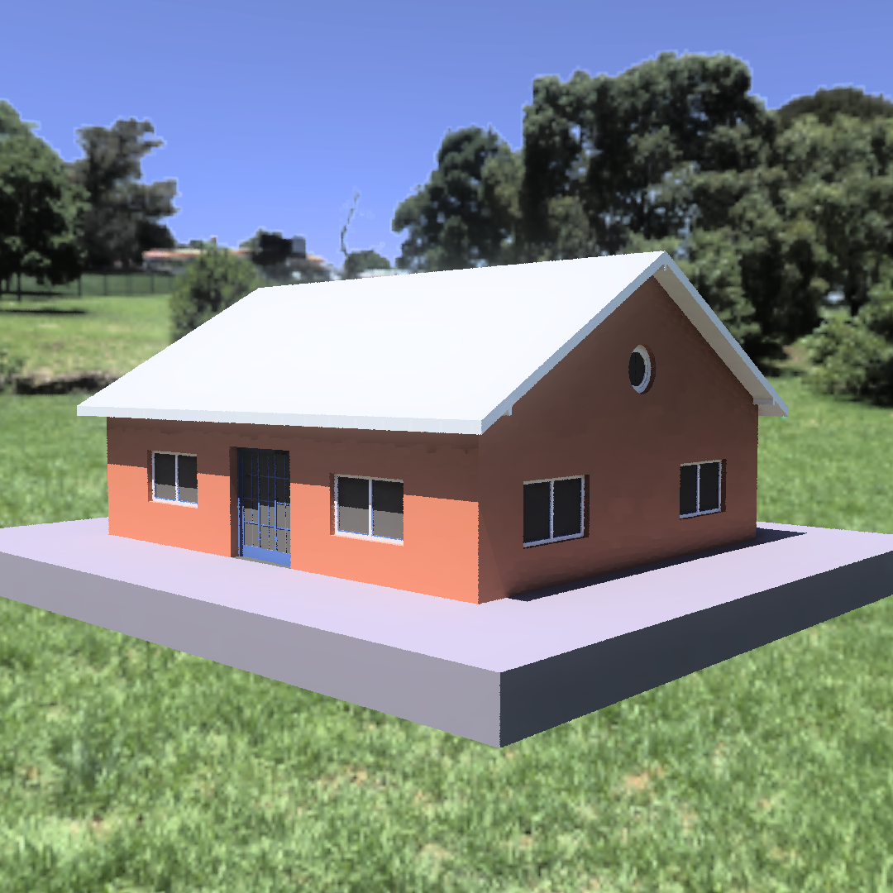

# Google Summer of Code 2024 Final Report: Radiance Rendering using BlenderBIM Add-on

## Project Overview

This summer, I had the opportunity to contribute to the BlenderBIM Add-on as part of Google Summer of Code 2024. The project focused on developing a Radiance exporter for the BlenderBIM Add-on, enhancing its capabilities in lighting simulation and analysis for BIM (Building Information Modeling) projects.

### Project Goals

The main objectives of this project were:

1. Implement a Radiance exporter within the BlenderBIM Add-on
2. Develop a user-friendly interface for configuring and running Radiance simulations
3. Integrate the exporter with existing IFC (Industry Foundation Classes) data structures
4. Provide functionality for material mapping and customization
5. Enable visualization of Radiance simulation results within Blender

6. I have also written a blog on how to use radiacne rendering feature that I have implemented - Blog (https://medium.com/p/0b9a2e748e9f)

## Accomplishments

Over the course of the program, I was able to achieve the following:

1. **Radiance Exporter Implementation**:

   - Developed a robust Radiance exporter that converts IFC geometry to Radiance-compatible formats
   - Implemented OBJ export functionality for geometry conversion
   - Created a material mapping system to translate IFC materials to Radiance materials

2. **User Interface Development**:

   - Designed and implemented a new panel in Blender's UI for Radiance export settings
   - Created intuitive controls for setting simulation parameters such as resolution, quality, and output options

3. **IFC Integration**:

   - Established a connection between the Radiance exporter and the existing IFC data structures in BlenderBIM
   - Implemented functionality to load IFC data either from memory or from an external file

4. **Material Handling**:

   - Developed a system for mapping IFC materials to Radiance materials
   - Created a user interface for manual material mapping and category assignment
   - Implemented JSON import/export functionality for material mappings

5. **Simulation and Visualization**:

   - Integrated PyRadiance library for running Radiance simulations directly from Blender
   - Implemented functionality to visualize Radiance simulation results within Blender's viewport

6. **Solar Analysis Tools**:
   - Enhanced existing solar analysis tools with improved UI and functionality
   - Implemented features for importing latitude/longitude data from IFC sites
   - Added visualization options for sun paths and shadows

### Radiance Exporter UI

One of the key achievements was the development of a user-friendly interface for the Radiance exporter. Here's a screenshot of the final UI:

### Material Mapping System

The material mapping system allows users to easily assign Radiance materials to IFC elements:

## Current State

The Radiance exporter for BlenderBIM is now functional and integrated into the add-on. Users can export IFC models to Radiance format, configure materials, set up simulations, and visualize results all within the Blender environment. The implementation includes:

- A new "Radiance Exporter" panel in Blender's UI
- OBJ export functionality for geometry
- Material mapping system with UI for customization
- Integration with PyRadiance for running simulations
- Enhanced solar analysis tools

### Simulation Results Visualization

Users can now visualize Radiance simulation results directly within Blender:

## Future Work

While the project has achieved its main goals, there are several areas for potential improvement and expansion:

1. **Performance Optimization**: Improve the efficiency of geometry export for large IFC models
2. **Advanced Material Handling**: Implement more sophisticated material translation from IFC to Radiance
3. **Expanded Simulation Options**: Add support for more complex Radiance simulation types
4. **Result Analysis Tools**: Develop additional tools for analyzing and interpreting Radiance simulation results
5. **Documentation and Tutorials**: Create comprehensive documentation and tutorial videos for users

## Code Integration

The code for this project has been integrated into the main BlenderBIM Add-on repository. Key pull requests and commits include:

- [[All My commits](https://github.com/IfcOpenShell/IfcOpenShell/commits/v0.8.0/?author=chiragsingh1711)]

- [[Link to main pull request for Radiance exporter implementation](https://github.com/IfcOpenShell/IfcOpenShell/pull/4995)]
- [[Link to pull request for UI enhancements](https://github.com/IfcOpenShell/IfcOpenShell/commit/0dde4102bc438168fd86c8b1e74c275a5d964aca)]
- [[Link to pull request for solar analysis improvements](https://github.com/IfcOpenShell/IfcOpenShell/commit/233b0856afa8a5edc00380608706e55aedcc4f07)]

## Challenges and Learnings

Throughout this project, I encountered several challenges and learned valuable lessons:

1. **IFC to Radiance Translation**: Translating IFC geometry and materials to Radiance format was complex and required a deep understanding of both systems.
2. **Blender Add-on Development**: Learning the intricacies of Blender's Python API and add-on system was challenging but extremely rewarding.
3. **Radiance Simulation Complexity**: Understanding and implementing Radiance simulations required significant research and experimentation.
4. **UI/UX Design**: Designing an intuitive user interface within Blender's constraints was an interesting challenge that improved my UI/UX skills.
5. **Open Source Collaboration**: Working with the BlenderBIM community taught me a lot about open-source development practices and collaboration.

## Conclusion

Participating in Google Summer of Code 2024 has been an incredible learning experience. I'm grateful for the opportunity to contribute to the BlenderBIM Add-on and the broader open-source community. I look forward to seeing how this work will be used and expanded upon in the future.

## Acknowledgements

I would like to thank my mentor Dion Moult for his guidance and support throughout this project. I also want to express my gratitude to the OSArch community for their feedback and assistance.
